# Face Detection with RLHF (Reinforcement Learning from Human Feedback)

A comprehensive **machine learning project** that implements an advanced face detection system combining transfer learning with human feedback for continuous improvement. The project leverages MobileNetV2's architecture as its backbone and implements a sophisticated RLHF (Reinforcement Learning from Human Feedback) pipeline, creating an adaptive system that learns from user interactions.

The model performs dual tasks: face detection with confidence scoring and precise bounding box prediction. Through a custom-built GUI application, users can not only detect faces in real-time but also provide feedback on the model's performance. This feedback is systematically collected and analyzed through a two-phase training approach that prioritizes challenging cases, ensuring the model continuously improves its accuracy and generalization capabilities.

What sets this project apart is its end-to-end implementation of the RLHF concept in computer vision. While traditional face detection models remain static after training, this system creates a continuous improvement loop where human feedback directly influences model behavior. The implementation includes comprehensive metrics tracking, automated parameter adjustment based on feedback patterns, and a structured approach to model enhancement.

  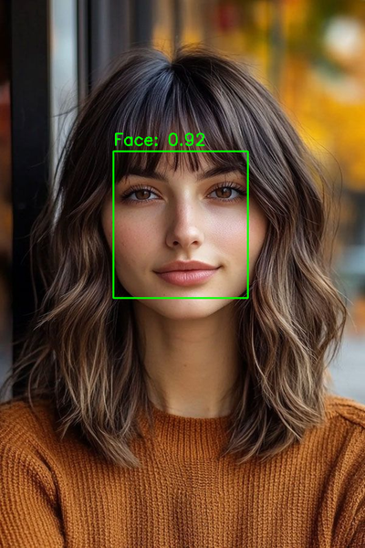

## Table of Contents
- [Overview](#overview)
- [Project Structure](#project-structure)
- [Installation](#installation)
- [Usage](#usage)
- [Dataset](#dataset)
- [Model Architecture](#model-architecture)
- [Training with Grid Search](#training-with-grid-search)
- [RLHF Implementation](#rlhf-implementation)
- [Results](#results)
- [GUI Application](#gui-application)
- [License](#license)

## Overview

This project implements a sophisticated face detection system that combines transfer learning with human feedback for continuous improvement. Built on MobileNetV2's architecture, the system performs dual tasks: face detection with confidence scoring and precise bounding box prediction, achieving robust performance through a carefully designed training pipeline.

The implementation features three key components:
1. **Transfer Learning Model**: Leverages MobileNetV2's pre-trained weights, adapted for face detection through a custom dual-head architecture for classification and bounding box regression.
2. **RLHF Pipeline**: Implements a systematic approach to collect and utilize human feedback, enabling continuous model improvement through a two-phase training strategy.
3. **Interactive GUI**: Provides a user-friendly interface for real-time face detection and feedback collection, creating a seamless loop between model predictions and user interactions.

The project is trained on a balanced dataset of 11,985 images, with a comprehensive evaluation system that tracks both traditional metrics and user feedback. Through the RLHF implementation, the model adapts to challenging cases and improves its performance based on real-world usage.

### Some results

  <h4>Dataset Results</h4>
  

    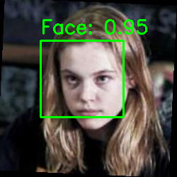
    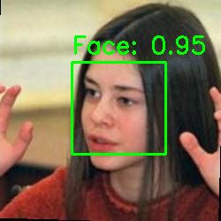
    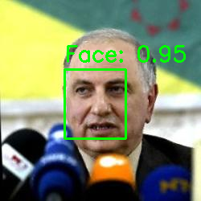
    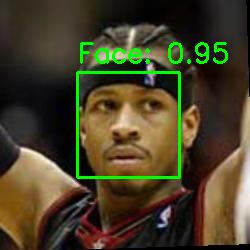
  

  
  <h4>RLHF Results</h4>
  

    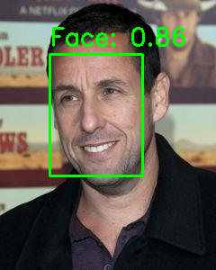
    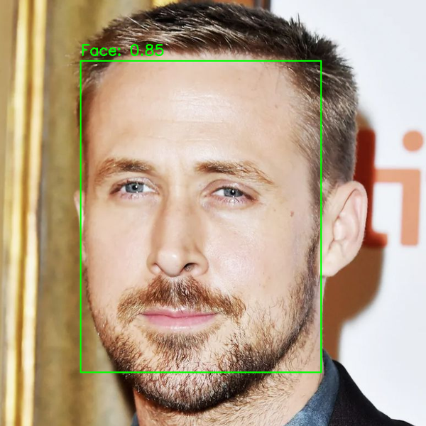
    
    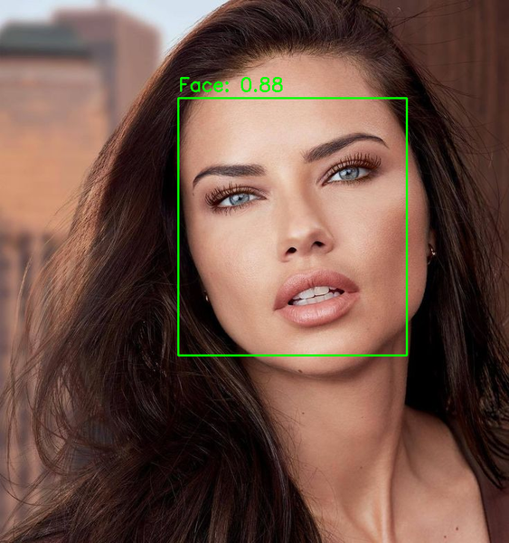
  

  
  <h4>Real World Results</h4>
  

    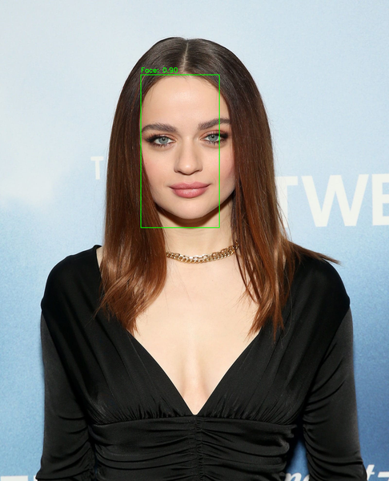
    
    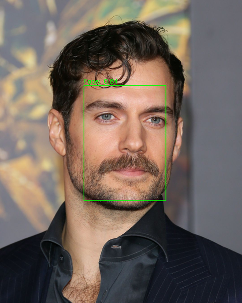
    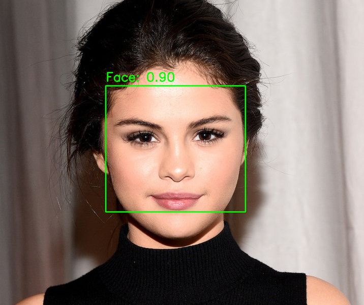
  

## Project Structure

<pre>
face_detection/
├── Data/                      
│   ├── Test/   
│       ├── Images/                  # Test set images
│           ├── x_y.jpg
│           └── ...
│       └── Labels/                  # Test set annotations
│           ├── x_y.json
│           └── ...
│   ├── Train/  
│       ├── Images/                  # Training set images
│           ├── x_y.jpg
│           └── ...
│       └── Labels/                  # Training set annotations
│           ├── x_y.json
│           └── ...
│   ├── Validation/ 
│       ├── Images/                  # Validation set images
│           ├── x_y.jpg
│           └── ...
│       └── Labels/                  # Validation set annotations
│           ├── x_y.json
│           └── ...
│   └── Data.csv                     # Dataset metadata and specifications
│
├── feedback/                        # Feedback system
│   ├── criteria.txt                 # Feedback evaluation criteria
│   ├── feedback_data.json           # Collected feedback data
│   ├── feedback_metrics.json        # Feedback analysis metrics
│   └── verify_feedback.py           # Feedback verification tools
│
├── grid_search_results/             # Hyperparameter optimization
│   ├── combination_1.json           # Individual trial results
│   ├── grid_search_results.csv      # Results summary
│   └── grid_search.log             # Training logs
│
├── models/                          # Trained models
│   ├── face_detection_XXXXXX/       # Model versions
│       ├── best_weights.weights.h5  # Best model weights
│       ├── evaluation_results.png   # Performance visualizations
│       ├── parameters.json          # Model parameters
│       └── training_history.json    # Training metrics
│
├── results/                         # Evaluation results
│   ├── best_model_improved_results/ # RLHF-improved model results
│       ├── orignal_dataset/         # Results on original data
│       ├── real_world_dataset/      # Results on real-world tests
│       └── rlhf_dataset/           # Results on RLHF data
│   └── rlhf/                       # RLHF analysis
│       └── analysis_feedback.png    # Feedback visualizations
│
├── rlhf/                           # RLHF implementation
│   ├── data/                       # RLHF training data
│   ├── augmentation.py             # Data augmentation
│   ├── dataset_creator.py          # Dataset management
│   ├── model_improver.py           # Model improvement
│   └── utils.py                    # Utility functions
│
├── scripts/                        # Training scripts
│   ├── train_gridSearch.py         # Grid search implementation
│   └── train.py                    # Base training script
│
├── src/                           # Core implementation
│   ├── feedback/                  # Feedback collection
│   ├── gui/                      # GUI implementation
│   ├── model/                    # Model architecture
│   └── utils/                    # Utility functions
│
└── requirements.txt               # Project dependencies
</pre>

### Key Components

1. **Data Organization**
   - Structured dataset splits with images and labels
   - Comprehensive metadata tracking
   - Standardized annotation format

2. **Model Development**
   - Grid search optimization
   - Multiple model versions
   - Training and evaluation scripts
   - Performance tracking

3. **RLHF System**
   - Feedback collection and analysis
   - Model improvement pipeline
   - Results visualization
   - Data augmentation

4. **User Interface**
   - Interactive GUI application
   - Real-time detection
   - Feedback submission
   - Result visualization

This structure ensures modular development, easy maintenance, and systematic tracking of experiments and improvements.
